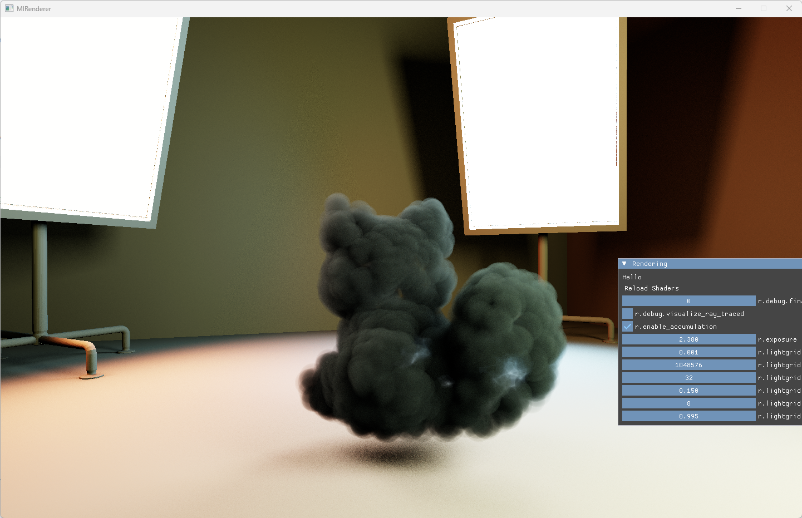

# MIRenderer
一个用于研究实时光照的RTGI和渲染框架，以及一些周边功能实现。

* 这是nightly branch，不保证可以运行;
## 安装和编译
### 安装外部依赖
* 仅支持NVIDIA RTX显卡。
* `Vulkan SDK`: https://vulkan.lunarg.com/ ，安装最新的Vulkan SDK，请使用1.4.350以及以上版本，较低版本会出现意外错误。
### 安装Vcpkg
安装vcpkg包管理器，并使用包管理器与`CMake`集成，然后安装以下依赖：
* `glm`
* `imgui[glfw-binding]`：必须安装`glfw-binding`特性！
* `stb`
* `gtest`
* `cpptrace`
* `xxhash`
* `cgltf`
* `happly`
* `nlohmann-json`
* `glfw3`
* `openvdb`
* `tinyexr`
* `vulkan-memory-allocator`
* `directx-dxc`
* `argparse`
* `zeromq`
* `cppzmq`
# 使用
### Target列表
* `3d_viewer`：一个简单的3D模型查看器，目前功能较为匮乏，是主要的测试程序，可以编辑其代码来加载不同模型。
* `core`：公共核心库。
* `rhi`：RHI抽象层。目前仅支持Vulkan。
* `rdg`：渲染图框架。
* `renderer`：渲染器实现。
* `util`：一些实用工具，比如模型加载。
* `micromc`：小玩具，用这个渲染器渲染几个mc区块。
### 调试和性能
* 鉴于性能问题，不推荐常用`Debug`模式调试程序。`Debug`模式会关闭大部分优化，CPU端性能会大幅下降。请使用`RelWithDebInfo`模式进行日常调试。
  * 如果遇到问题，可以使用`Vulkan Configurator`（随Vulkan SDK一起安装）来调整运行时选项，开启`Vulkan Validation Layer`来检查API调用是否合法。
  * 如果遇到难以定位的问题，可以此时再切换到`Debug`模式进行调试，以性能为代价，程序中的大量调试检查或许会对你有帮助。
    * 此时，你可以使用`debug_prof.h`内的宏分析程序（CPU）内的运行热点。
  * 如果遇到极难定位的问题，可以进一步开启`MI_BYPASS_RHI_THREAD`选项，让RHI线程和渲染线程合并成一个线程，方便使用调试器进行单步调试。
    * 此时，可以进一步开启`Vulkan Configurator`中的`Break on Validation Error`选项，在出现问题时程序会自动中断，你可以用IDE查看栈帧。
  * 如果遇到`device lost`（驱动程序挂起）但`Vulkan Validation Layer`没有任何报错——这通常是GPU端崩溃（如shader越界、光线追加速结构遍历异常等），CPU端调试手段无效。此时可以开启**Nsight Aftermath**捕获GPU崩溃转储：
    * 在CMake配置时加上`-DMI_ENABLE_AFTERMATH=ON`重新configure并重新编译。这会链接NVIDIA Nsight Aftermath SDK，并在创建设备时启用`VK_NV_device_diagnostics_config`扩展。
    * SDK随Nsight Graphics安装（无需单独下载）。CMake会自动在常见安装路径下搜索所有Nsight Graphics版本并选用最高版本，你也可以用`-DMI_NSIGHT_GRAPHICS_DIR=...`指定某个Nsight Graphics安装目录。
    * 开启后，再次复现`device lost`，程序退出时会在可执行文件目录下生成`mi_aftermath_<时间戳>.ndump`（主转储）以及若干`mi_aftermath_<时间戳>_shader_<n>.nvdbg`（逐shader调试信息旁车文件）。控制台会打印生成的转储路径。
    * 在Nsight Graphics中`File → Open Crash Dump`打开`.ndump`，即可看到出错的shader、出错指令、寄存器/调用栈、以及在途的资源等，从而精确定位崩溃源头。
    * 注意：开启Aftermath有性能开销（shader debug info + 资源追踪），仅用于调试`device lost`，定位完成后请关闭。
* 如果要深入调试Shader，请使用`NSight Graphics`进行抓帧，抓帧后可以查看Shader代码、资源绑定、实时检视资源内容等信息。
  * 你可以在Shader中使用`printf`函数进行调试输出，此时，请开启`Vulkan Validation Layer`，并开启`Debug Printf`选项，输出会显示在控制台中。
* 使用`heob`可以在Windows下对此程序进行内存泄漏与非法访问监测，你也可以使用Visual Studio自带的工具（如果你正在使用VS的话！）。
* 最终性能测试，请使用以下配置：
  * 使用`Release`模式编译，并关闭`MI_BYPASS_RHI_THREAD`选项。
  * 如果你打开了`Vulkan Configurator`，请关闭它。
### 资源层级、持有方式和释放备注
* 在不深入RHI层，或者需要创建新类型的Renderable时，资源层级和释放机制基本不需要关心。但若要深入RHI层进行修改，或想要拓展Renderable，则需要了解资源层级和释放机制。
* 资源层级分为两类：RHI资源、Host资源。其中，Host资源可以细分为RHI SubAllocation类和纯Host类两种。
  * RHI资源：直接对应RHI API的资源，由RHI层管理，比如`RHIBuffer`、`RHITexture`等。
  * Host资源：不直接对应RHI API的资源，或者纯粹Host资源。
    * RHI SubAllocation类：这些资源享有一个RHI资源的**一部分**，但不直接管理RHI资源的生命周期，也不由RHI层管理。比如`DeviceUberBufferAllocation`、各类对应一个RHI Buffer内某Slot的SlotKeeper等。
    * 纯Host类：这些资源完全在Host端管理，它们可能持有一些RHI资源和RHI SubAllocation句柄。比如`Material`、`DeviceGeometry`等。
* 在`mi`渲染器外，一般而言，如果你想要一个资源活得久，你必须持有其`TRef`引用。未被引用的资源会自动在合适时机释放。
* 不同资源的释放时间是有区别的。
  * 对于RHI资源和RHI SubAllocation类资源，它们的释放必须**延迟**一帧以上进行，防止在GPU-CPU并行时，在GPU上还在使用的资源被CPU释放了。
    * 对于RHI资源，引用计数由RHIResource基类实现，自动延迟释放。
    * 对于RHI SubAllocation类资源，它们的延迟释放依赖于`DeviceBindlessResourceAllocator`和`DelayedDestructionResource`系列基类和模板，该分配器会在每帧结束时收集待释放的SubAllocation。
  * 对于纯Host类资源，它们的释放可以立即进行。
### 线程关系备注
* 线程分五类别：RHI线程、渲染线程、工作线程、主线程、FIO线程
* **只有**RHI线程负责与图形API交互，RHI线程只有一个
* **只有**渲染线程负责与RHI线程交互。一般而言，**只有**渲染线程能访问/**间接或直接持有**/使用RHI资源引用，渲染线程只有一个
  * 多线程编译管线时是个例外，你可以查阅`rdg_shader.cpp`中相关实现，了解如何在工作线程中访问RHI资源。
  * 部分RHI API调用也实际上是线程安全的。这在RHI层中会有相关注释。
* 渲染器核心中（`mi`中），FIO线程专门负责文件读写。异步文件读写请求都通过Infra委托FIO线程完成，同步读写则由各自线程完成，Infra的读写接口是线程安全的。
* 在一些调试模式下，RHI线程和渲染线程合并成一个线程。
* 工作线程和主线程不能持有，也不能直接使用任何Device相关方法。它们应当仅限于在Host端进行计算和数据处理。
  * 创建、持有Geometry/StaticMesh等没有问题，但不能在线程内使用UpdateOnDevice等方法，也不应该持有DeviceXXXX的引用。